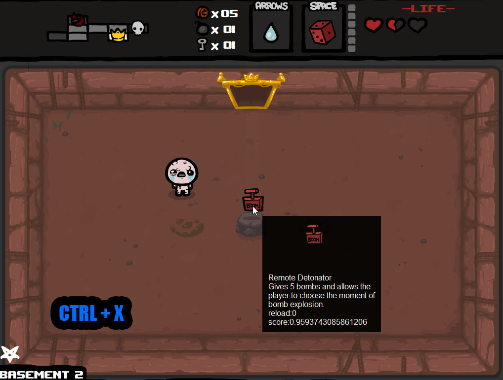

# The Binding of Isaac (Flash) Item description tool via real-time object detection system yolov8 with tkinter interface on python 3.13 


## Install and use
No instalation need. Program starts about 25sec
Hower mouse to item and use hotkey ctrl-x. Popups window which auto destroy after 5sec.
* Select description language in settings.ini -  en / ru
* Can change hotkey in setting.ini
* Window destroy time in setting.ini

## Обучение (\utilites\recog_test2)
Брелки 35 - базовая модель yolov8m-cls.pt, канал RGB, 50 epoch, image count 3+1х2 per class (train x validate), "+1" alpha image
Предметы 195 -  базовая модель yolov8m-cls.pt, канал RGB, 50 epoch, image count 11+1х5
Модель '-cls' (классификая), чтобы не надо было labels размечать в обучающих выборках, а также определение позиции мне не нужно, т.к пользователь сам находит предмет. Модель преобученная потому, что датасет мелкий. 
Используется medium модель потому, что на 1ом тесте показал что лучше распознаются, чем в small, хотя может это случайный разброс весов при инициализации, не проверял. Может быть на small можно с повышением количества эпох добится таких же результатов, чтоб модельку 6 мб использовать, а не 30мб - не проверял. Скорее всего small или nano не получиться использовать из за того, что классов много - 195 предмета, 35 брелка, если только на брелках.

Модели v8 базовые преобученные скачать тут: https://learnopencv.com/ultralytics-yolov8/

Обучил 2 модели, потому что когда обучал вместе и предметы и брелки, то брелки практически не распозновались. Пробывал уровнять по количеству картинок обучающую выборку, но не помогло, хотя отличаются они только тем, что предметы стоят на "постаменте" (камень, сундук, сердце).

Нужно ли было включать предмет без фона в обучающую выборку я так и не понял, но включил (без альфы).

Так как игра полностью генерируемая, то обучающие выборки получилось самому сгенерировать. Фон + предмет.
Обучал в RGB канале без альфа потому, что при тесте картинок с альфа каналом на моделе меньше score. Черно Белым не делал потому, что есть похожие предметы, но с разными цветами типо: Doctor’s Remote, teleport или 1UP, Magic Mushroom, Mini Mush.

Картинки из исходных размеров сделал 200х200. Можно было 100 на 100, но больше взял, чтоб проще было попадать курсором по предмету, хотя может это и не влияет.

<table>
<tr>
<th> Folder structure </th>
<th> data.yaml </th>
</tr>
<tr>
<td>

recog_test2/    - распознование через yolov8
 ├─ dataset/    - generated dataset for train here
 │  ├─images/	- yolo train folder
 │  │ ├─ train/	- yolo imgs for train
 │  │ └─ val/   - yolo imgs for validate
 │  ├─ data.yaml  - yolo folder config (classes, folder structure)
 │  ├─ itemsImgs/ - for generate imgs dataset for generate new imgs
 │  ├─ testImgs/  - test manual imgs
 │  └─ dataset.csv- for generate imgs items names and props dataset (is trinket or not, eng name, filename)
 ├─ runs/	  - yolo put trained model here
 ├─ generate_imgsForTrain.py	- gets alfa images from itemsImgs/ and make game like 
 │				  images and put here dataset/images/train or validate
 └─ yoloTrainAndTest.py		- yolo start train model

</td>
<td>
path: dataset/images
train: train
val: val
names:
0:Anarchist Cookbook
1:The Bean
...
</td>
</tr>
</table>

## датасет парсинг (\utilites\parseHTML)
предметы https://bindingofisaac.fandom.com/ru/wiki/%D0%90%D1%80%D1%82%D0%B5%D1%84%D0%B0%D0%BA%D1%82%D1%8B_(Flash)
берелки https://bindingofisaac.fandom.com/ru/wiki/%D0%91%D1%80%D0%B5%D0%BB%D0%BE%D0%BA%D0%B8_(Flash)
Скачал страницы и парсил голый html, скачанные картинки положил в itemsImgs/. Пришлось парсит с русской педии через С# потому, что питоновский lxml не мог срез дерева возвращать.
dataset.csv колонки:
- **nameRU** — Название на русском
- **nameEN** — Название на английском. Классы Yolo сделаны из этой колонки, поэтому yolo model возвращает его (ИДшник класса). yolo id != dataset id незнаю почему так.
- **imgSrc** — Ссылка на картинку онлайн
- **descrRU** — Описание предмета на русском
- **imgName** — Название картинки скачанной. некоторые имели одинаковые название (брелки) пришлось переименовывать
- **reloadCnt** — Перезарядка предмета измеряется в кол-ве комнат
- **isPassive** — Пассивный предмет
- **isWrath** — Предмет из аддона wrath of the lamb
- **isTrinket** — Брелок
- **imgSrc_dataset** — Ссылка на картику локальная
- **descrEN_trans** — Описание предмета переведённая на английский через гугл докс
- **urlToPageRU** — Ссылка на страницу предмета в русской педии
dataset.webp - картинки всех предметов и брелков для того, чтобы много файлов не было. 10 колонок, картинка 100 х 100. Используестся только для отображение картинки в интерфейсе (не для обучения).

## opencv template matching (\utilites\recog_test1)
Распознавание по шаблону давало никакущие результаты наверно потому, что сравнение идет по пиксельное, а от сжатия картинки или разрешения экрана или наличию фона у картинки слишком много пиксельных различий.

## Build pyinstaller
Файл исполняемый получается 300-800 Мбайт в зависимости от флага --onefile или --onedir и 600 мб оперативной памяти. Пробывал построить в виртуальном проистранстве без лишних библиотек - меньше не стало. Библиотеки которые загружает в --onedir:
lib	mb
torch	750
polars_runtime_32	317
cv2	157
scipy	98
python	52
numpy.libs	20
scipy.libs	19
pandas	12
PIL	12
matplotlib	11
torchvision	11
numpy	6
ultralytics	3
tcl data	3
tk data	0,83
pandas.libs	0,56
tzdata	0,5
contourpy	0,4
tc18	0,27
certifi	0,66
yaml	0,48
numpy-2.4.O.dist-info	0,2
kiwisolver	0,15
dateutil	0,15
lap	0,09
psutil	0,069
torchvision-O.26.O.dist-info	0,036
charset normalizer	0,025
setuptools	0,017
markupsafe	0,013

## Структура репозитория
```text
 root/
 ├─ utilites/           - вспомогательные програмы
 │   ├─ parseHTML/      - спарсить скачанный html датасет
 │   ├─ recog_test1/	- [obsolete]распознование через opencv template
 │   └─ recog_test2/    - распознование через yolov8
 │	├─ dataset/     - файлы для датасетов dataset.csv dataset.webp
 │	│  ├─images/	- yolo train folder
 │	│  ├─itemsImgs/	- img dataset for generate new imgs
 │	│  ├─testImgs/	- manual yolo test items
 │	│  ├─data.yaml	- yolo folder config (classes, folder structure)
 │	│  ├─1.csv	- parsed html data for dataset.csv
 │	│  ├─2.csv
 │	│  ├─3.csv
 │	│  ├─4.csv
 │	│  ├─5.csv
 │	│  ├─descrEN.csv    - manual col
 │	│  ├─urlToPageRU.csv- manual col
 │	│  ├─chest.png	 - for generate img
 │	│  ├─dataset.csv - joined and fixed parsed html data dataset
 │	│  ├─heart1.png	- for generate img
 │	│  ├─heart2.png- for generate img
 │	│  ├─Isaac_3eTD5cCqeC.png- for generate img
 │	│  ├─Isaac_5wuX8Aq31h.png- for generate img
 │	│  ├─Isaac_jLexJZq15A.png- for generate img
 │	│  ├─Isaac_ltMKQBAIFR.png- for generate img
 │	│  ├─Isaac_OF2MXLRUlC.png- for generate img
 │	│  ├─Isaac_OZeZClNK1w.png- for generate img
 │	│  ├─Isaac_SJ38P8Z62j.png- for generate img
 │	│  ├─Isaac_SRLkNTzOWK.png- for generate img
 │	│  ├─rock.png - for generate img
 │	│  └─trinket_shelf.png - for generate img
 │	├─ runs/	- yolo put train results here
 │	├─ generate_imgDataset.py	- make dataset.webp from dataset.csv and dataset/itemsImgs/
 │	├─ generate_imgsForTrain.py	- make and copy images for train yolo in dataset/images/
 │	├─ isaacDataset.ipynb		- join and filter parsed html via pandas makes dataset.csv 
 │	└─ yoloTrainAndTest.py		- yolo train models and test models
 ├─ dataset.csv 	- item text dataset
 ├─ dataset.webp        - item img dataset (for interface show only)
 ├─ ItemModel.pt 	- yolo trained model for items
 ├─ TrinketModel.pt	- yolo trained model for trinkets
 ├─ settings.ini	- некоторые регулироуемы параметры интерфейса(хоткей, время уничтожения)
 ├─ binding_of_issac_FLASH_item_description.py - основная точка входа в приложение
 ├─ requirements.txt 	- зависимости главной программы (не утилит)
 └ README.md            - этот файл
```

## Зависимости
keyboard # set hotkey (admin)
pyautogui # get mouse x y position
ultralytics # recognise img with YOLOv8
mss # screenshot
numpy # screenshot to img
pandas # dataset read, filter
pillow # show image, cut image from img dataset
pyinstaller # build exe
tkinter # interface
---

## Ошибки
Little C.H.A.D. не находит в датасете из-за точки в конце у yolo модели почемуто её нет.

## Лицензия

Проект распространяется под лицензией MIT License.